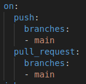

# COSC2759 Assignment 1
## Notes App - CI Pipeline
- Full Name/Names: Avariq Fazlur Rahman / Bernard Choa
- Student ID/IDs: s4115250 / s4115597

### Guidance (remove this section before final submission)

1. Refer for assignment specification `Marking Guide` for details of what should appear in this README.

2. If you do not see an `Actions` tab in your GitHub, email matthew.cullen@rmit.edu.au with URL to your repository, so that it can be enabled.

3. Implement your CI pipeline in the directory `.github/workflows`.

4. Refer to [src/README.md](/src/README.md) for important details on building and testing the application.

5. Commit images to the `img` directory and add them like 
    ```html
    
    ```
    

6. Only edit THIS README.md - not the src/README.md
## 1. Introduction of Pipeline
### 1.1 Initialization of Project using CI Pipeline
The CI Pipeline for this project begins with the name of the project, which in this case will be "Notes Application CI Pipeline". Below that, we will denote where the packages are pushed and where pull requests will be made to.
```html
```

In this instance, 
### 1.2 Linting

## 2. Automated Testing
### 2.1 Unit Testing
### 2.2 Implementation Testing
### 2.3 End-to-End Testing