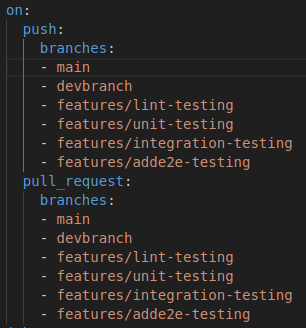
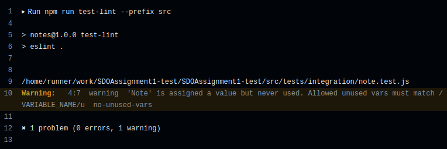

# COSC2759 Assignment 1
## Notes App - CI Pipeline
- Full Name/Names: Avariq Fazlur Rahman / Bernard Choa
- Student ID/IDs: s4115250 / s4115597

## 1. Introduction of Pipeline
A CI pipeline is made as a means of automating tests that are usually ran for ensuring the quality and robustness of an application. With a CI Pipeline, a runner can just follow the steps that are given within the pipeline as the code is directed into the repository, making it easy and efficient for testing.
### 1.1 Initialization of Project using CI Pipeline
The CI Pipeline for this project begins with the name of the project, which in this case will be "Notes Application CI Pipeline". Below that, we will denote where the packages are pushed and where pull requests will be made to.



In this instance, we made sure that the workflow will run from any change made into any of the repositories that are made into the project, be it in the development cycle, or when we are pushing to the main branch.

### 1.2 Linting
The next process that is done in this project is Linting. Linting is done to ensure that the code is clean and neatly made. To do linting, we must run this line of command :

```html
npm run test-lint --prefix src
```

This command will ensure us about any errors or maybe warnings we'd want to watch out for in the writing of this code. It should output a report of your code such as so :



This line will show us if there are any errors or any warnings, such as the picture warning us that there are unused variables in this code.

## 2. Automated Testing
### 2.1 Unit Testing
### 2.2 Implementation Testing
### 2.3 End-to-End Testing